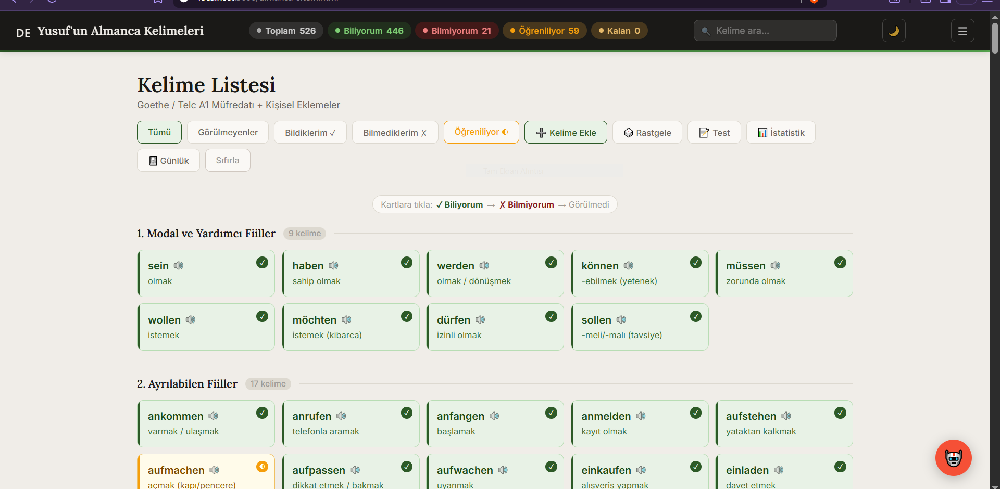
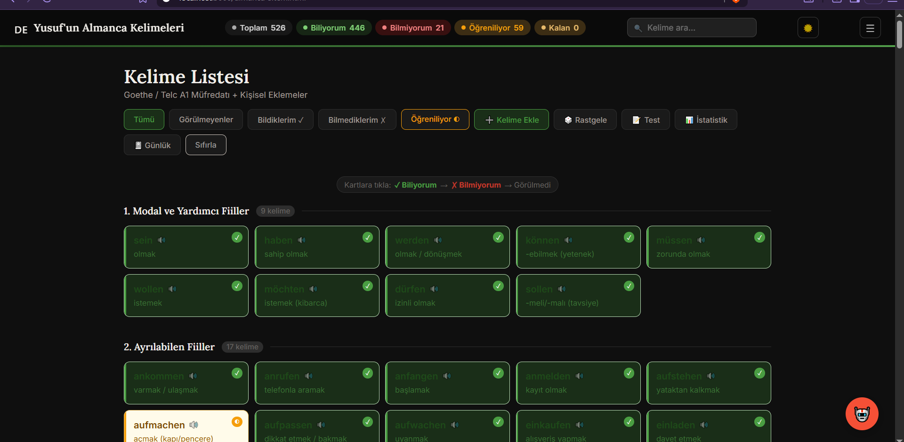
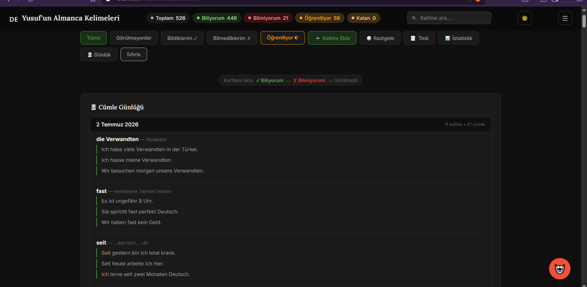
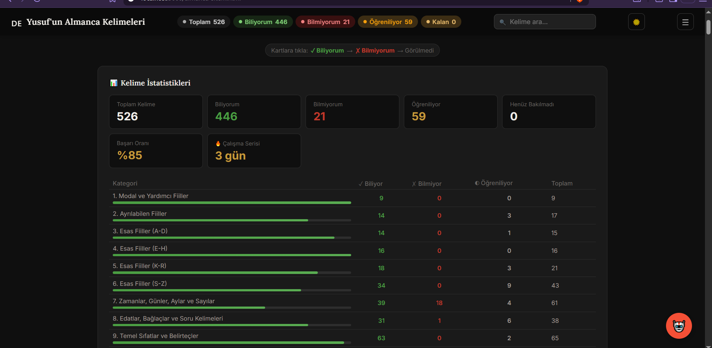
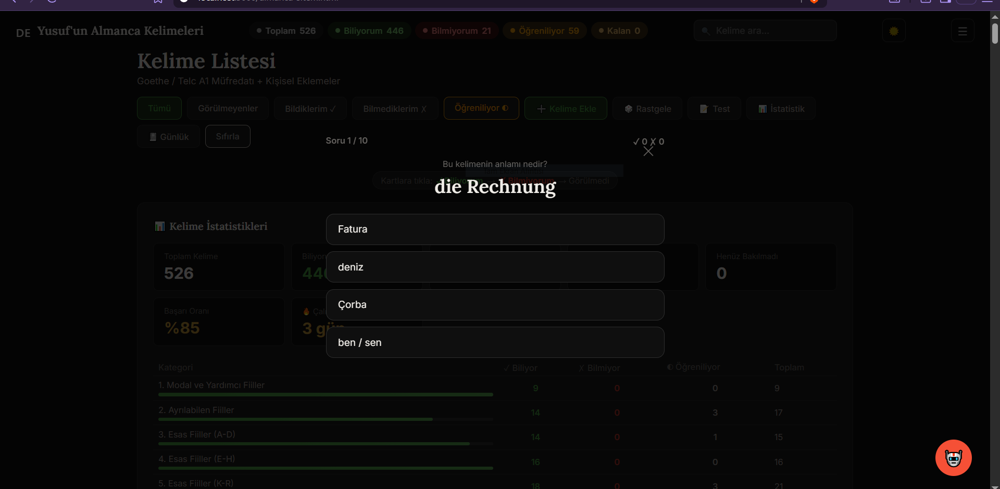

# 🇩🇪 German Vocabulary Tracker

A personal German vocabulary learning tool I built while preparing for my move to Germany.  
Started as a simple word list — evolved into a full desktop application.

> **Honest note:** I don't have a programming background. The ideas, features, and content decisions are mine. Development was done in collaboration with Claude AI. Think of it like an architect who designs the building but works with engineers to construct it.

---

## 📸 Screenshots

**Main view — Light mode**


**Dark mode**


**Sentence journal** — write example sentences for words you're learning


**Statistics panel** — track progress by category with streak counter


**Multiple choice quiz**


---

## ✨ Features

- **500+ vocabulary words** organized into 14 categories (A1–A2 level + personal additions)
- **Word status tracking** — mark words as *Known*, *Learning*, or *Not Known*
- **Spaced repetition** — unknown words appear more frequently in practice sessions
- **Random word mode** — weighted queue system, each word shown once per round
- **Multiple choice quiz** — filter by status, choose question count
- **Sentence journal** — write example sentences for each word, saved by date
- **Right-click menu** — mark words, change category, delete, or build a sentence
- **Custom word support** — add your own words, saved persistently
- **Statistics panel** — progress by category, streak counter, learning overview
- **Dark mode** — preference saved automatically
- **Export** — download word list as `.txt` (German only or German + Turkish)
- **Desktop app** — packaged with Electron, runs as a standalone `.exe`

---

## 🛠 Tech Stack

| Layer | Technology |
|---|---|
| Frontend | HTML, CSS, JavaScript |
| Backend | Node.js + Express |
| Desktop | Electron |
| Data | JSON (local file, not a database) |
| AI Integration | Groq API (LLaMA 3.3) |

---

## 📁 Project Structure

```
german-vocabulary-tracker/
├── almanca-sitem.html   ← Main UI (all frontend + logic)
├── main.js              ← Electron main process
├── preload.js           ← Electron context bridge
└── package.json         ← Dependencies
```

> `veri.json` (user data) is excluded from this repository via `.gitignore` — it contains personal word states, journal entries, and custom words.

---

## 🚀 Getting Started

```bash
# Install dependencies
npm install

# Run in browser mode (Node.js + Express)
node main.js
# Open http://localhost:3000/almanca-sitem.html

# Or run as desktop app (Electron)
npm start
```

---

## 🧠 How It Was Built

This project grew organically over several weeks:

1. **Started** as a static HTML word list with a search feature
2. **Added** a Node.js + Express backend to persist data between sessions
3. **Configured** pm2 to run the server automatically on startup
4. **Migrated** to Electron to package it as a proper desktop application
5. **Continuously added features** based on what I actually needed while studying

Every feature in this app exists because I ran into a real problem while learning German and decided to solve it.

---

## 🌍 Why This Project?

I'm preparing for an apprenticeship (*Ausbildung*) in **Fachinformatiker für Systemintegration** in Germany.  
Learning German is part of that journey. Instead of using a generic app, I built my own — and in doing so, learned about servers, file systems, process management, desktop packaging, and API integration along the way.

---

## 📅 Development Log

See [DEVLOG.md](DEVLOG.md) for a detailed history of bugs fixed and features added.

---

*Built with curiosity and Claude AI · 2025–2026*
